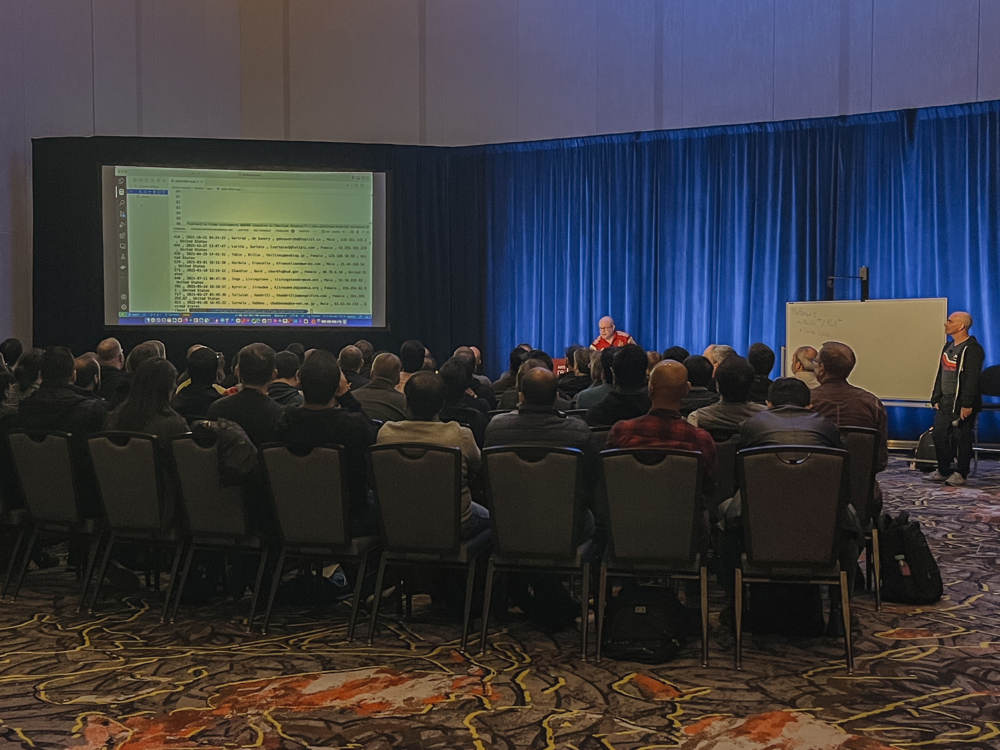

<!-- _class: lead -->

# re:Invent2022 @vegas<!--fit-->

<!-- comment:
  ...
-->

---
<!--paginate: true -->
<!--header: ""-->

# 들어가기 전에
5 keynotes.  
22 leadership talks.  
2,300 sessions in total

<!-- comment:
    AWS Free-tier 만 사용해본 초급 사용자 입장에서, 개인적으로는 새롭다고 느낀 것들을 정리해봤으나 전혀 새롭지 않을 수 있고, 다녀온지 시간이 제법 지났기때문에 이미 다 알고 계신 내용일 수도 있다는 점 양해 바람.
-->
---
<!--paginate: true -->
<!--header: ""-->

# 들어가기 전에

출장을 준비하며, 다음과 같은 것들을 기대

* DE 업무 관련 AWS 활용 사례 수집
  * `분석워크로드`, `워크플로우`, `HPC`
* 기술 동향, 미래의 Major Player 탐색
* 다른 금융사의 사례 수집

---
<!--header: 들어가기 전에-->

---
<!--header: 들어가기 전에-->

---
<!--header: ""-->

# DE 업무 관련 AWS 활용 사례 수집

* `FSx for Lustre`
* `ECS Anywhere` ✕ `Airflow ECSOperator`
* `AWS Parallel Cluster`

---
<!--header: 업무 관련 Best Practices 엿보기-->

# `FSx for Lustre`

> Virtually Unlimitted Compute Scale, Fully-managed

* https://www.lustre.org/

<!-- comment:
  lustre 라는 오픈소스 파일시스템을 기반으로 HPC 등에서 활용하기 좋은 FSx 서비스.
  대충 빠르고 좋은 파일시스템이라고 생각하면 됨, 그만큼 다루기 어려울 수 있겠는데 AWS 에서 다 관리해줌.
  Elastic Network Interface 활용해서, 대역폭 제한 없이 선형으로 성능 늘어남.

  * https://aws.amazon.com/ko/blogs/storage/persistent-storage-for-high-performance-workloads-using-amazon-fsx-for-lustre/
  * https://www.youtube.com/watch?v=6848CCaIqSY&list=PL2yQDdvlhXf_hIzmfHCdbcXj2hS52oP9r&index=99
-->

---
<!--header: 업무 관련 Best Practices 엿보기-->

# `FSx for Lustre`

---
<!--header: 업무 관련 Best Practices 엿보기-->

# `ECS Anywhere` ✕ `Airflow ECSOperator`

* https://dev.to/aws/orchestrating-hybrid-workflows-using-amazon-managed-workflows-for-apache-airflow-mwaa-2boc
* https://aws.amazon.com/ko/blogs/aws/getting-started-with-amazon-ecs-anywhere-now-generally-available/

<!-- comment:
  온프렘 같이 AWS 리전 밖의 컨테이너를 AWS 에서 관리할 수 있게 하는 방법 소개.
  ECS Anywhere 를 이용하면 AWS 리전 외부에 구성된 ECS Agent 에서 명령을 받아다가 컨테이너 작업을 수행해줄 수 있는데, Airflow ECSOperator 와 함께 조합하면 AWS 에서 여러 환경의 워크플로우를 통합 관리할 수 있음.
-->

---
<!--header: 업무 관련 Best Practices 엿보기-->

# `AWS Parallel Cluster`<!--fit-->

* `CfnCluster` 기반
* https://aws.amazon.com/ko/hpc/parallelcluster/

<!-- comment:
  workshop 유형의 세션이었고, self-paced lab 이랑 비슷했는데 세션장에 있는 사람들이 다 같은 내용을 실습해보는 점이랑 실제 specialist 들이 조교 역할을 수행해줘서 몰입도가 훨씬 좋았던 것 같음.

  클릭 몇 번으로 cluster 를 구축하고 간단한 샘플 mpi 작업 돌려보는 것까지 해볼 수 있었음.
-->

---
<!--header: ""-->

# 기술 동향, 미래의 Major Player 탐색

* `Redshift`
  * A Zero-ETL Future ...
  * 셀립스키가 많이 밀어줌.

<!-- comment:
    서비스들을 조합하는것에 어려움.
    앞으로는 이런 중간 과정을 없애는 DB/분석 서비스 간 통합을 
    https://youtu.be/LQbdJiPNstE?t=350
-->
---
<!--header: 기술 동향, 미래의 Major Player 탐색-->

# `Redshift`

  * Amazon Aurora zero-ETL integration with Amazon Redshift
  * Amazon Redshift integration for Apache Spark
  * Amazon Redshift auto-copy form S3
* serverless

<!-- comment:
  * https://aws.amazon.com/ko/blogs/big-data/top-analytics-announcements-of-aws-reinvent-2022/
-->

---
<!--header: ""-->

# 다른 금융사의 사례 수집

* `NatWest`

---
<!--header: 다른 금융사의 사례 수집-->

# `NatWest`

* https://aws.amazon.com/ko/blogs/machine-learning/part-1-how-natwest-group-built-a-scalable-secure-and-sustainable-mlops-platform/

<!-- comment
  NatWest 의 데이터팀과 AWS 의 Specialist 들이 함께 만든 NatWest 의 MLOps 소개. 은행과 같은 특수한 환경에서도 `AWS Professional Services` 와 Specialist 들과 함께라면 MLOps 할 수 있어. 프로페셔널 서비스 홍보처럼 넘어간 듯.
  
  아무튼 SageMaker 는 원래 짱인데 은행처럼 특수한 환경에서도 `CodeArtifact` 라던지, dev/test/prod 환경별로 권한이 제한된 배포 모델을 도입해, Secure 하고 Auditable 한, SageMaker 기반 MLOps 를 할 수 있다는 사례를 보여준 세션.
-->

---
<!--header: ""-->

# 마치며
